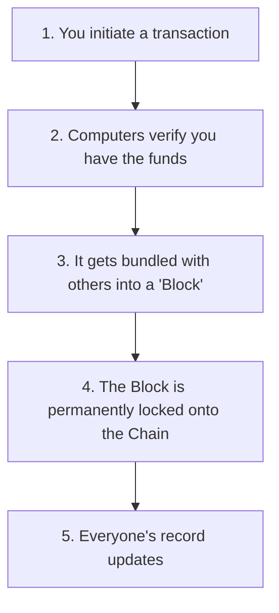

# Understanding Blockchain

Imagine a shared google doc that thousands of people have access to. Whenever someone makes an update, everyone’s doc updates at the exact same time. If someone tries to cheat and change a past record, the team rejects it because it doesn't match their docs and record.

**That is a blockchain.**

Instead of a doc, it’s a digital record book (**ledger**) maintained by thousands of independent computers (**nodes**). It tracks ownership of money, data, or digital items securely without needing a central authority defies the working principle of a bank.

## Key Terms

- **Block:** A bundle of recent transactions, like a single page in the record book.
- **Chain:** Blocks are permanently linked together in a chronological order. Changing a past block breaks the chain, making any sort of tampering obvious to everyone.
- **Decentralization:** No central authority controls the data, the entire network maintains it collectively.

## How It Works

## What Makes It Unique?

- **No Single Point of Failure:** If one computer goes offline, the system still runs perfectly because thousands of others have a copy.
- **Permanent Record (Immutability):** Once data is locked onto the chain, it cannot be secretly edited, deleted, or censored by anyone, if it does the entire network will get to know.
- **Built-in Trust:** You don't need to know or trust the person you are transacting with, because the math and the network automatically makes the rules.

## Popular Networks

- **Bitcoin:** Secure digital money.
- **Ethereum:** The main network for programmable code and [smart contracts](understanding-smart-contracts).
- **Layer 2s (Arbitrum, Polygon):** Express lanes built on top of ethereum in case where Ethereum gets packed and expensive.
- **Solana:** Built for high-speed, low-cost applications.

Your [wallet](understanding-wallets) connects you to this network, securely holding your [tokens](understanding-tokens) and keeping track of your records.